# ODIS Website

Repository for the website of Berlins Open Data Informationsstelle (ODIS).

## Setup

This site is build with Astro. Make sure Node.js >+ 20 is installed on your system. Best way to do this is using [nvm](https://github.com/nvm-sh/nvm).

### Installation of Node.js, npm and Astro dependencies (once)

You can use [nvm](https://github.com/nvm-sh/nvm) to install different Node.js versions.

```bash
curl -o- https://raw.githubusercontent.com/nvm-sh/nvm/v0.39.1/install.sh | bash
# Reload your shell session
exec $SHELL
```

After that you can install the needed Node.js version.

```bash
# move into the repo
cd path/to/ods-website
# update your local version to the latest state
git pull origin master
# intall the used Node.js version using nvm
nvm install
```

When everything went smoothly you can go ahead and install eleventy's dependencies.

```bash
# move into the repo
cd path/to/ods-website
# install eleventy's dependencies
npm ci
```

## Command Line Usage

Install dependencies

```bash
npm ci
```

Just writing posts (without working on js or css):

```bash
npm start
```

Development:

```bash
npm run dev
```

Building site:

```bash
npm run build
```

# Technology Stack 🧰

This section describes what technologies are used and gives advice on the fundamentals to be learned in order to manage the website’s contents, layout and structure.

## Tech Overview

The website is build with:

- **[Astro](https://docs.astro.build/en/getting-started/):** A content-focused web framework for static and server-side rendered pages (in this case mostly static pages)
- Vanilla (regular) [TypeScript](https://www.typescriptlang.org/): In the context of Astro, simple script tags can be included to add JS sprinkles on the pages. Those are either inlined as-is or bundled automatically by Astro. [Read more here](https://docs.astro.build/en/guides/client-side-scripts/#_top). In the case of ODIS, we use inline scripts for legacy code that was brought over from the old page, and Astro-bundled scripts for new components.
- [MDX](https://docs.astro.build/en/guides/markdown-content/#_top): In the context of Astro, we use MDX to redact the contents of the page, which has many advantages:
  - The [frontmatter](https://docs.astro.build/en/guides/cms/frontmatter-cms/#_top) of MD and MDX files allow for metadata to be defined for each page, and this metadata can be [validated against a schema](https://docs.astro.build/en/guides/content-collections/#defining-a-collection-schema), which ensures quality.
  - In MDX, the regular markdown body can be [extended with custom Components](https://docs.astro.build/en/guides/markdown-content/#mdx-only-features) (Written in Astro, React, or another framework, in our case plain Astro) and are useful to give pages personality and custom layouts.

## Fundamentals

It can be necessary to familiarize or even master some fundamental technologies to be able to manage and/or extend the website’s contents and/or code:

### To Manage the Contents:

- **HTML and [Astro’s custom JSX](https://docs.astro.build/en/basics/astro-syntax/#differences-between-astro-and-jsx)** to write custom markup inside the MDX files and to know how to format the custom components’ syntax to avoid error.
- **CSS and especially [TailwindCSS](https://tailwindcss.com/)** if you wish to modify the styling of elements/components within your markdown beyond what markdown itself permits.
- [\*\*Markdown and MDX](https://docs.astro.build/en/guides/markdown-content/#_top)\*\* to understand how to write the formatted data, the markdown body, and to know how to take advantage of MDX to use custom components.

### To Change the Code

If you want to change the underlying code, you will need to additionally know:

- JavaScript/[TypeScript](https://www.typescriptlang.org/)
- [Astro](https://docs.astro.build/en/getting-started/) itself

---

# Managing and Creating Contents ✍️

This section describes how to create and modify the contents of the pages, how to format them, and how to add assets.

<aside>
☝ This doesn’t include how to fundamentally change the pages’ structure or code logic. For more on this, go to the section *“About the Code 👩🏾‍💻”* below.

</aside>

## Content Files Structure

The site contents are almost all situated in the **`src/content`** folder. Within this folder, you will find many different folders containing **`.md`** or **`.mdx`** files. The file names of these files usually represent or resemble the URL-slug of the page they’re displayed on. A URL-slug is the last part of an URL path structure. For instance, if the URL is **`https://example.com/projects/new/my-new-project?r=2`**, the URL-slug here is **`my-new-project`**.

There are some exceptions, in which the file name isn’t closely corresponding to the URL-slug:

- When the file is either called **`index.mdx`** or the same way as its parent folder, it’s the parent folder’s name which represents the URL-slug.
- When a folder ends with “Overview”, for example, **`projectsOverview`**, the URL-slug will represent or resemble the part preceding “Overview”, in this case **`projekte`**.
- The **`homepage`** folder contains content for the URL root path **`/`** because it doesn’t have an URL-slug.

Here are some examples of markdown files and their respective URL-slug:

| File-path                                                     | URL-path                                 |
| ------------------------------------------------------------- | ---------------------------------------- |
| src/content/about/about.mdx                                   | /about                                   |
| src/content/aktuelles/2020-02-26-abschluss-geodaten/index.mdx | /aktuelles/2020-02-26-abschluss-geodaten |
| src/content/moduleOverview/aktuellesOverview.mdx              | /module                                  |

It’s important to note that what determines the final URL-slug is the structure used in the code placed in **`src/pages`**. The structure in **`src/content`** just slightly mimics the real structure to help content-writers easily find the file to edit. The site leverages an Astro feature called [content collections](https://docs.astro.build/en/guides/content-collections/#_top), which allows validating the structure of the frontmatter (more on that in the section _“Managing and Creating Content > Frontmatter”_).

<aside>
☝ Because the file and folder structure is reflected in the URL-slug, take care to change the paths in Links and imports in other documents when changing the content structure. Otherwise, you might end up with broken code or broken links.

</aside>

## Frontmatter

### What is a Frontmatter?

The **frontmatter** of a markdown file (**`.md`** or **`.mdx`**) is the part at the beginning of a file preceded and succeeded by **`---`**. It contains metadata written in the [YAML](https://en.wikipedia.org/wiki/YAML) markup language, which can be parsed and understood by the code, and placed in specific locations of a page. It contains information that does not relate to the main body of text of a page.

### Frontmatter Schema Validation

In Astro, this frontmatter can be validated with a schema, ensuring that content follows a strict structure and avoids unused content remains.

The schema for these different frontmatter structures is declared in **`src/content/config.ts`**. It uses the schema validation library Zod to define the schema. It is useful to look at the schema of the corresponding file type to know what can, and what cannot be omitted or used. For instance, if editing the file **`src/content/aktuelles/2020-02-26-abschluss-geodaten/index.mdx`**, I might want to look at the schema called **`aktuellesSchema`** in the aforementioned **`config.ts`** file:

```jsx
const aktuelles = defineCollection({
  type: "content",
  schema: ({ image }) =>
    z.object({
      title: z.string(),
      description: z.string(),
      metaTitle: z.string().optional(),
      ...
    }),
});
```

In this schema, I can see that the frontmatter for pages in the **`src/content/aktuelles`** folder require a **`title`** and a **`description`** property to be set, and optionally a **`metaTitle`**. It also indicates what type of data is expected there (in this case, some strings).

If I omit any of these values, the browser will display the following error message in the browser window:

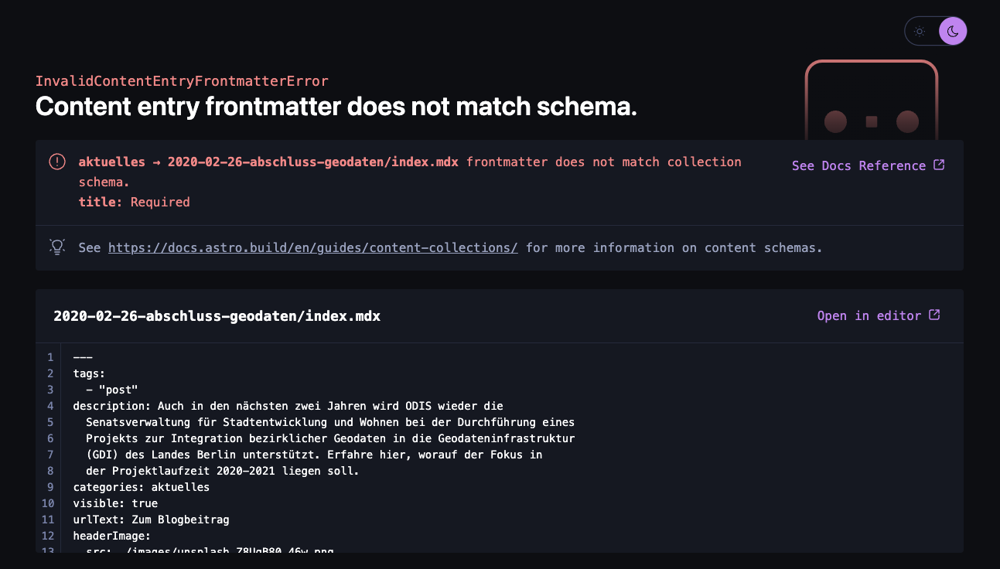

In this case, Astro indicates which property is missing in which file.

### Dates in Frontmatter

Dates need to be formatted in a certain way within the frontmatter in order to be correctly parsed as such. Follow the format **`YYYY-MM-DD`** and you’ll be fine.

### Images in Frontmatter

To reference images in your frontmatter, first place your image in a folder called **`images`** next to your markdown file, and reference it with a path, relative to the markdown page. For example, given the image **`src/content/aktuelles/2023-12-21-luftguete/images/unsplash_bkzjNDPQ3Hg.png`** and the markdown file **`src/content/aktuelles/2023-12-21-luftguete/index.mdx`**:

```jsx
---
...
headerImage:
  src: ./images/unsplash_bkzjNDPQ3Hg.png
...
---
```

<aside>
☝ Note that most of the images referenced in the frontmatter are accompanied by an alt property. **This is very important for accessibility** reasons and should be taken seriously. [Learn here how to write good alt texts.](https://accessibility.huit.harvard.edu/describe-content-images)

</aside>

### Using Frontmatter Tags

The tags properties within the frontmatter serve a specific purpose: Determine where this page will be displayed. There are a few special tags that can be used:

- `home`: This can be used on resources, news items (aktuelles), and projects to make them visible in the respective sliders on the homepage. For example, if you want to highlight some important news on the homepage but want to avoid that all news are displayed there.
- `post`: Everything with this tag will appear on the **`aktuelles`** page. This includes external links (aktuelles), blogposts (aktuelles), projects, and resources.

### Using the `visible` property

In the frontmatter, all content types share a boolean property called **`visible`**. This property, when set to **`false`** can be used to hide a page from lists. For example, you could create a project that is reachable via its URL, but won’t appear in the **`/projekte`** page. This can be helpful to use as a way to create purpose-specific pages that aren’t intended for the general public.

## Markdown body

The Markdown body is the part in a **`.md`** or **`.mdx`** file that is below the frontmatter, in other words below the last triple dash sign (**`---`**). It represents the main body of text and is written in either regular markdown syntax (**`.md`** file) or in MDX (**`.mdx`** file) which is more powerful and lets you import and display more complex Astro, React, Vue, Svelte components, or any other component from a view library that is integrated with your Astro site. (In our case none, as we use vanilla JavaScript).

### Regular Markdown Syntax

The regular markdown syntax enables you to format your text while keeping your file simple and easily portable to other applications. It is a set of conventions to follow that will turn simple characters into formatting. For example, an asterisk before and after a set of words will make it bold: **`_This is bold_** This isn't`

To learn more about what you can do with markdown, [checkout the official documentation](https://www.markdownguide.org/).

In order to read longer texts in the body click shift + command + p an select “Toggle Word Wrap”

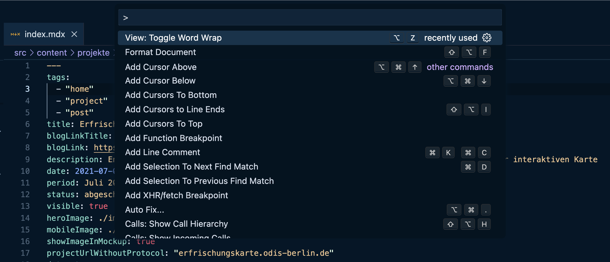

### MDX Components

In the section below called “Importing Your Own Components” is described how you can import custom Astro components for more interesting layouts and interactivity.

## Importing Your Own Components

MDX is an extension of markdown that enables more advanced features for the cases where regular markdown isn’t enough. The main feature of MDX is the ability to import and render Components within your main body text, thus enabling more complex layouts, interactive pages, and the intertwining of text and different media.

**Example:**

```tsx
## Hintergrund und Zielsetzung

Gieß den Kiez ist eine kartenbasierte Anwendung des CityLAB Berlin und visualisiert über 750.000 Straßen- und Anlagenbäume der Stadt Berlin. Die Anwendung wurde Mitte Mai 2020 ins Leben gerufen und ist eine von vielen Antworten auf die anhaltenden Dürre- und Trockenperioden aufgrund derer in den letzten drei Jahren tausende Bäume in Berlin gefällt werden mussten. Seither wird Gieß den Kiez rege durch die Berliner:innen genutzt, die mit Hilfe einer interaktiven Karte protokollieren können wann, wie oft und mit wie viel Wasser sie einen Baum gegossen haben. Seit Launch der App zählen wir exakt 2.085 Gießer:innen, die über 6.285 Bäume in über 25.900 Gießungen mit mehr als 775.000 Liter Wasser ehrenamtlich gegossen haben (Stand: 30. September 2021).

Hover über die Karte und die Baumpunkte! Finde heraus welcher Baum am meisten Wasser erhalten hat und in welchem Bezirk die Nutzer:innen von Gieß den Kiez besonders aktiv waren. Bäume die besonders viel gegossen wurden zeigen ein besonders hohe Wassersäule. Wir wünschen viel Spaß!

import GDKPlot from "@/components/pageSpecific/GDKPlot.astro"

<GDKPlot />
```

In this example, the two hashes (##) is a regular markdown syntax that will convert the following text to an HTML **`<h2>`** element. Further below, an Astro component **`GDKPlot.astro`** is imported (like in a JavaScript file using the import syntax) and rendered directly within the markdown body text. In this case, the GDKPlot component is an interactive webmap that relates to the text. This illustrates well how very specific interactive content that goes beyond simple formatting can also be authored within the content of the text.

To learn more about MDX, check out [Astro’s dedicated documentation page](https://docs.astro.build/en/guides/markdown-content/#mdx-only-features).

<aside>
☝ In the context of the ODIS Website, a few built-in components are made available for you to use. What they are and how to use them is described in the section below “Using Built-In Components”.

</aside>

<aside>
ℹ️ See how the path to the component is written? It starts with the symbol @ and represents the `src` folder. This allows for an absolute path that does not break when moving files up and down the hierarchy and avoids long paths like `../../../../../mycomponent.astro`.

</aside>

## Using Built-In Components

In the context of the ODIS Website, several built-in components are made available for you to use, which are utilized on many different pages.

### ContentSection

On most pages on desktop and tablet devices, the main body of text resides in a narrow column layout to make space on the right for the table of contents. The **`ContentSection`** component has a few particularities:

- It accepts a **`caption`** property, which describes the content it displays.
- It accepts a **`withShadow`** property that optionally adds a shadow (to say an image with white background).
- It accepts a **`fullWidth`** property that enables its contents to take the full width of the page, beyond the size of the column layout it is in. It calculates the space to the left of the content column and offsets itself by that value to the left. It then expands to the full width of the screen, allowing its contents to position themselves relative to the full screen, independently from the text column it is in.

**Example:**

```tsx
import GreatDataViz from "@/components/GreatDataViz";

<ContentSection
  caption="A data visualisation of great importance"
  withShadow
  fullWidth
>
  <GreatDataViz /> {/* Put any contents here */}
</ContentSection>;
```

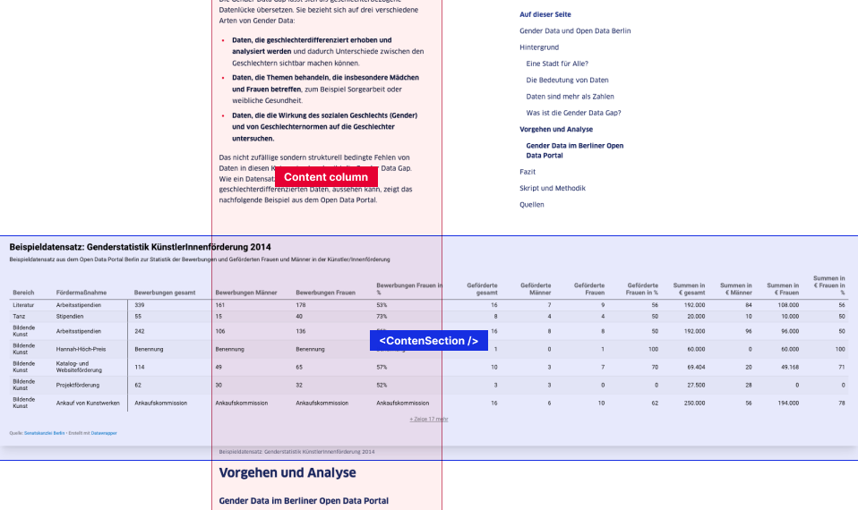

<aside>
☝ Notice how the properties `withShadow` and `fullWidth` are written without an equal sign? This is a feature of JSX allowing to omit the `={true}` in `withShadow={true}` and `fullWidth={true}` only when the value is `true`.

</aside>

**FullWidth smaller Images**

If you want an image to run somewhat smaller than at fullWidth you can use the following code:

```jsx
*import* image1 *from* "./images/volksbuehne.png";
<ContentSection *class*="sm:px-6">
<ImageSection *class*="sm:container sm:mx-auto"
*src*={image1}
*caption*="Dieser Ausschnitt zeigt die Volksbühne, die einen Wärmevebrauch von über 1.500 kWh im Jahr aufweist."
/>
</ContentSection>
```

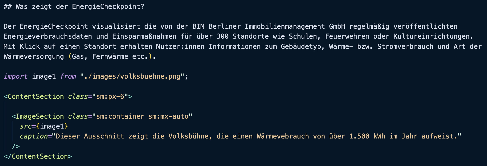

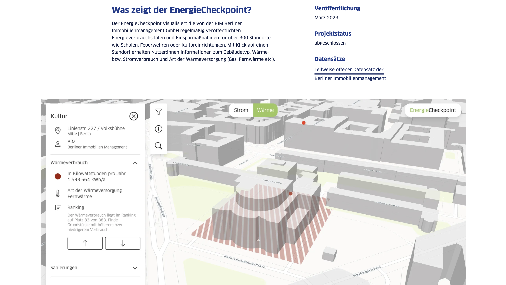

### TextContentSection

Contrary to **`ContentSection`**, this component displays its children in the same column layout as the regular body of text but sets an alternative background color that spans the full width of the page.

**Example:**

```tsx
<TextContentSection class="bg-bg-alt">
  <h2>Das Ziel im Blick – Zentrale Vorteile von Open Data</h2>
  <p>
    Open Data bildet die Grundlage für evidenzbasierte Planungen, Monitoring und
    strategische Handlungsentscheidungen für Politik und Verwaltung.
  </p>
</TextContentSection>
```

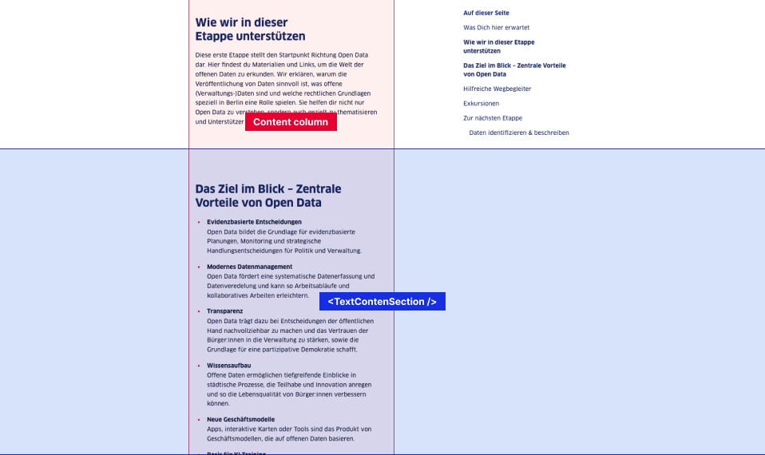

Here, the **`TextContentSection`** simply creates a new “lane” and provides it with a TailwindCSS class **`bg-bg-alt`** to set the lane's background to something else.

### PdfEmbed

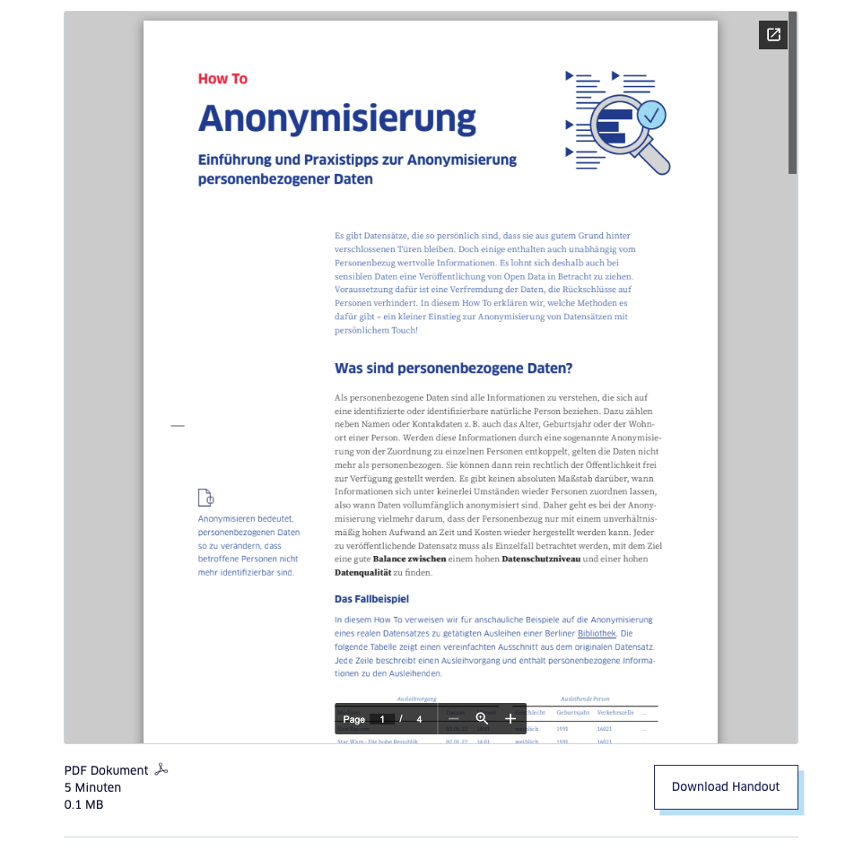

This component displays a PDF preview on the page. It uses Google’s PDF preview service, which ensures all PDFs look the same across all browsers. It also provides an area to display metadata and a download button. It accepts the following properties:

- **`filePath`**: The path to the PDF file. PDF files should be placed into the public folder in the **`file-download`** folder.
- `downloadLinkText` (optional): The text of the button to download the PDF (defaults to “PDF herunterladen”)

- **`mediaMetadata`** (optional): A metadata object containing information about the media:
  - **`thumbnail`**: A reference to an Astro image (either imported from within the MDX file or forwarded from the front matter: **`frontmatter.media.thumbnail`**)
  - **`type`** (optional): Either **`video`**, **`pdf`**, **`blog`**, **`table`**, **`project`**, or **`other`**. Defaults to **`other`**. This will be used to select the relevant icon in the metadata section.
  - **`readingOrPlayingTime`** (optional): A text indicating how long the video is or how long it takes to read the article.
  - **`size`** (optional): The size of the downloadable asset.
  - **`link`** (optional): The link to the media (for download or YouTube, for instance).
- **`buttons`** (optional): An array of objects with the following properties, that will render buttons next to the metadata:
  - **`text`**: The button text.
  - **`link`**: The button link.
  - **`isDownloadable`** (optional): Whether clicking on the button will trigger a download or just open in the browser window (defaults to false).

<aside>
☝ Note that in local development mode, the browser's native PDF preview is used instead of Google’s PDF preview service, as it only works with absolute URLs that are available online.

</aside>

### VideoEmbed

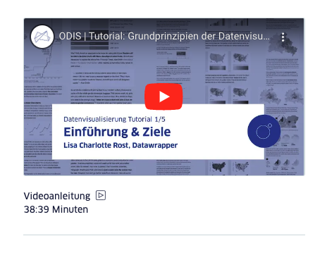

This component embeds either an internal (self-hosted) video file in a media player or renders a video in an iframe from an external service (YouTube/Vimeo). It also provides an area to display metadata and a button linking to the video. It accepts the following properties:

- **`url`**: The path to the video file (starting with a **`/`** if local and **`https`** if external). Local video files should be placed into the public folder in the **`videos`** folder.
- **`elementProps`** (optional): The additional attributes to be passed to the iframe or video HTML tag in case of needing custom behavior (loop, allowfullscreen, etc.)

### MediaSection

This component is a lower-level component used in **`PDFEmbed`** and **`VideoEmbed`** to display the metadata below the PDF/Video preview. It can also be used as a standalone. It accepts the following properties:

### Quote


This component is useful for displaying citations in quotation marks, as well as additional information about the author. It accepts the following properties:

- **`authorName`** (optional): The full name of the author.
- **`authorRole`** (optional): The role of the author in their institution or company.
- **`authorAvatar`** (optional): A portrait image of the author.
- **`authorLogo`** (optional): A logo image of the author’s institution or company.

All properties can be omitted. Only the provided properties will be rendered.

### ProjectReference, ResourceReference and AktuellesReference

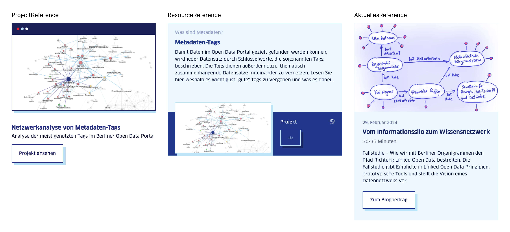

These components allow you to reference either a project, resource, or news item (aktuelles) from within the body of text. They all require only one property:

- **`slug`**: The URL-slug of the page. For instance, for the news item whose markdown content lies in **`src/content/aktuelles/2024-02-29-linked-open-data/index.mdx`**, the URL-slug is **`2024-02-29-linked-open-data`**.

```jsx
<ProjectReference *slug*="2021-03-netzwerkanalyse_metatags" />
```

**Setting an internal link without Reference**

[Text you want to link](slug ( = path like it is seen in the browser), example: /projekte/2023-07-organigramm-tool)
Exemple: [Hier sehen Sie unser Organigramm-Tool](/projekte/2023-07-organigramm-tool)

## Importing External iframes

A common use case on the ODIS website is displaying data visualizations or interactive maps from other places. To achieve this, it relies on **`iframe`** elements. MarkdownX (or MDX) allows for the insertion of regular HTML within the markdown body. This means that adding regular **`iframe`** elements should work by simply pasting the embed code into the markup.

**Example:**

```tsx
Text....

<ContentSection fullWidth={true}>
  <iframe
    src="https://evelyne-brie.shinyapps.io/ALLRIS_Cumul/"
    width="100%"
    height="500px"
    title="My file"
    loading="lazy"
  ></iframe>
</ContentSection>

Text....
```

### Import Datawrapper Charts

Datawrapper makes it easy and quick to visualize data in interactive and beautiful charts. This is why embedding iframes from Datawrapper is the most common use case on the ODIS website. Sometimes, even multiple iframes are embedded on the same page. Datawrapper embed codes come with an additional **`script`** tag. If embedding multiple Datawrapper iframes on the same page, this **`script`** tag only needs to be included **once.**

**Example:**

```tsx
<iframe
  title="Anzahl der Metadateneinträge nach verwendeter Tags, Top 15 mit Gender-Referenz"
  aria-label="Balken (gestapelt)"
  id="datawrapper-chart-C09he"
  src="https://datawrapper.dwcdn.net/C09he/1/"
  scrolling="no"
  frameborder="0"
  style="width: 0; min-width: 100% !important; border: none;"
  height="501"
  data-external="1"
  loading="lazy"
></iframe>

<iframe
  title="Anzahl der Metadateneinträge nach verwendeter Tags, Top 15 ohne Gender-Referenz"
  aria-label="Balken (gestapelt)"
  id="datawrapper-chart-1k84m"
  src="https://datawrapper.dwcdn.net/1k84m/1/"
  scrolling="no"
  frameborder="0"
  style="width: 0; min-width: 100% !important; border: none;"
  height="501"
  data-external="1"
  loading="lazy"
></iframe>

<script
  type="text/javascript"
  set:html={`!function(){"use strict";window.addEventListener("message",(function(e){if(void 0!==e.data["datawrapper-height"]){var t=document.querySelectorAll("iframe");for(var a in e.data["datawrapper-height"])for(var r=0;r<t.length;r++){if(t[r].contentWindow===e.source)t[r].style.height=e.data["datawrapper-height"][a]+"px"}}}))}();`}
/>
```

**!!! So, when copying the embed codes from Datawrapper, remove the script part and include the following only once per page:**

```tsx
<script
  type="text/javascript"
  set:html={`!function(){"use strict";window.addEventListener("message",(function(e){if(void 0!==e.data["datawrapper-height"]){var t=document.querySelectorAll("iframe");for(var a in e.data["datawrapper-height"])for(var r=0;r<t.length;r++){if(t[r].contentWindow===e.source)t[r].style.height=e.data["datawrapper-height"][a]+"px"}}}))}();`}
/>
```

## Using Images

For Astro to optimize the images for better performance, they need to be imported/referenced in a particular way depending on the context.

### **In the frontmatter**

When referencing images from within the front matter of a markdown page, use a string path, relative to the markdown file.

<aside>
☝ Preferably place your images in a folder called `images` placed right next to your markdown file. This makes removing the right images when removing a page easier.

</aside>

**Example:**

```yaml
headerImage:
  src: ./images/unsplash_Q8urQ8ow7CU.png
  alt: Menschen, die eine Strasse entlanggehen mit einer Flagge um die Schultern
```

### Within the markdown body

Using images within the markdown body should be done the following way:

1. Import the image using an import statement and a relative path like so:

   ```tsx
   import image1 from "./images/gender-mainstreaming-berlin.png";
   ```

2. Pass the value of the image to the **`ImageSection`** component or any other component requiring an image (like quote, for example):

   ```tsx
   <ImageSection
     src={image1}
     caption="Cover des Berliner Handbuchs zu Gender Mainstreaming in der Stadtentwicklung, Senatsverwaltung für Stadtentwicklung, 2011"
   />
   ```

## Using Icons

To use icons from within a markdown file or an Astro component itself, you need to use the **`Icon`** component provided by the `[astro-icon` package](https://github.com/natemoo-re/astro-icon#readme).

**Example:**

```tsx
import { Icon } from "astro-icon/components"; // Import the component

// Use the component
<Icon name="ui/check" size={20} />;
```

The name represents the path to the icon relative to the **`src/assets/images/icons`** folder. The base folder is defined in the **`astro.config.mjs`** file when configuring the plugin.

## Adapting the HTML / CSS Within MDX Files

As stated earlier, markdown files can include regular HTML, which allows for more custom and complex layouts. For styling, the CSS utility library [TailwindCSS](https://tailwindcss.com/) is used. It makes styling the DOM elements easier without the need to switch context. It can be used in combination with HTML in the markdown files to achieve more complex results.

**Example:**

```tsx
<ul class="lg:grid lg:grid-cols-2 lg:gap-x-6">
  <li>
    <strong>Evidenzbasierte Entscheidungen</strong>
    <p class="mt-0 text-balance">
      Open Data bildet die Grundlage für evidenzbasierte Planungen, Monitoring
      und strategische Handlungsentscheidungen für Politik und Verwaltung.
    </p>
  </li>
  <li>
    <strong>Modernes Datenmanagement</strong>
    <p class="mt-0 text-balance">
      Open Data fördert eine systematische Datenerfassung und Datenveredelung
      und kann so Arbeitsabläufe und kollaboratives Arbeiten erleichtern.
    </p>
  </li>
  <li>
    <strong>Transparenz</strong>
    <p class="mt-0 text-balance">
      Open Data trägt dazu bei Entscheidungen der öffentlichen Hand
      nachvollziehbar zu machen und das Vertrauen der Bürger:innen in die
      Verwaltung zu stärken, sowie die Grundlage für eine partizipative
      Demokratie schafft.
    </p>
  </li>
  <li>
    <strong>Wissensaufbau</strong>
    <p class="mt-0 text-balance">
      Offene Daten ermöglichen tiefgreifende Einblicke in städtische Prozesse,
      die Teilhabe und Innovation anregen und so die Lebensqualität von
      Bürger:innen verbessern können.
    </p>
  </li>
  <li>
    <strong>Neue Geschäftsmodelle</strong>
    <p class="mt-0 text-balance">
      Apps, interaktive Karten oder Tools sind das Produkt von
      Geschäftsmodellen, die auf offenen Daten basieren.
    </p>
  </li>
  <li>
    <strong>Basis für KI-Training</strong>
    <p class="mt-0 text-balance">
      KI-basierende Algorithmen benötigen strukturierte (offene) Daten, um zu
      lernen und zuverlässige Ergebnisse zu liefern.
    </p>
  </li>
</ul>
```

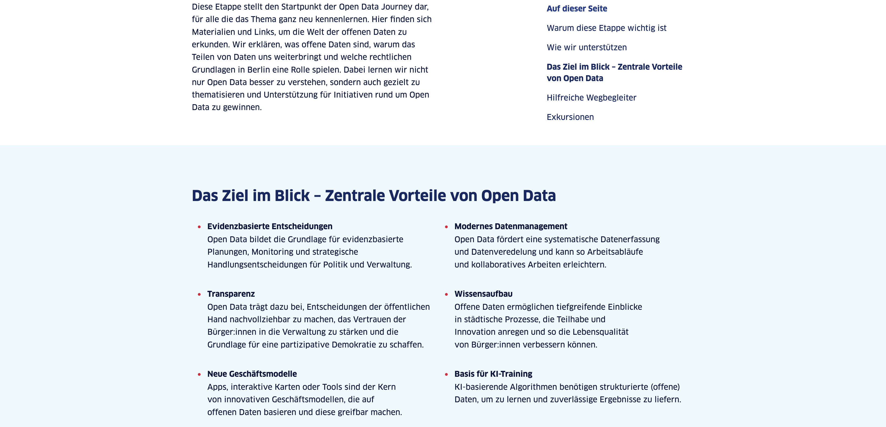

<aside>
☝ It is important to note that markdown syntax cannot be used if wrapped by an HTML tag or an Astro component. From this point on, all child markup must be JSX (Astro or HTML).

</aside>

## Using Custom OG Images

Open Graph (OG) images are the images displayed when sharing a URL on external websites and services. This could happen when sharing on LinkedIn or Twitter, or when sharing a link in messaging apps.

The ODIS Website is configured to show a default OG image that automatically displays the title and description of the page on a white image.

<aside>
👀 They usually look something like this:

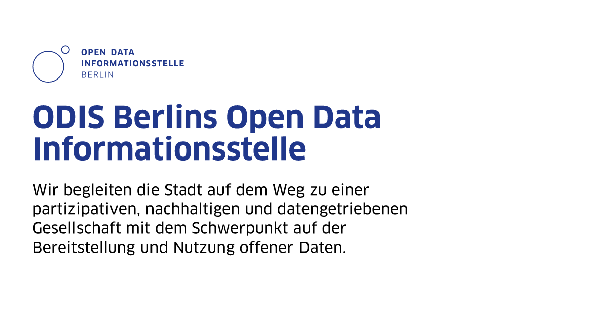

</aside>

While showing the title and description in the image does the trick in most cases, it isn’t the best user experience. For instance, when sharing a project on LinkedIn, it would be better to have an OG image that contains a screenshot, maybe the URL of the project, and a custom layout.

You can override the default image and provide your own. To do this, place your custom image in the project (probably next to your markdown file in an image folder and name it **`og-image.jpg`**), and reference it in the front matter in the **`ogImage`** key.

**Example:**

```tsx
---
...
title: Berlins Daten-Neuheiten
**ogImage: ./images/og-image.jpg**
...
```

---

# About the Code 👩🏾‍💻

This section provides additional details on the implementation of the page and offers guidance on how to extend or modify the current code.

<aside>
☝ If you encounter an issue or need assistance with something you can't resolve after reading the documentation, please refer to the section *“Help & Contact 🆘”* below.

</aside>

## Files Structure

The project structure largely follows Astro's file structure. Here are the main folders and files you should be aware of:

### Configuration files

| Name                | Purpose                                                                                                                                                                                                                                                |
| ------------------- | ------------------------------------------------------------------------------------------------------------------------------------------------------------------------------------------------------------------------------------------------------ |
| .all-contributorsrc | List of all contributors of the projects. Is used to generate the contributors section in the README. Using https://github.com/all-contributors/all-contributors                                                                                       |
| .eslintrc.js        | https://eslint.org/docs/latest/use/configure/configuration-files configuration file. It configures the linting rules of the project.                                                                                                                   |
| prettierrc.json     | https://prettier.io/docs/en/configuration configuration file. It configures the formatting rules of the project.                                                                                                                                       |
| astro.config.mjs    | https://docs.astro.build/en/guides/configuring-astro/ configuration file. It configures the project, the used astro plugins, and more.                                                                                                                 |
| netlify.toml        | https://docs.netlify.com/configure-builds/file-based-configuration/ configuration file. It configures the deployment of the project on http://netlify.app. It also configures which pages will have a lighthouse report run as a post deployment step. |
| .nvmrc              | Contains the node version to be installed and run by https://github.com/nvm-sh/nvm?tab=readme-ov-file#nvmrc. It ensure everybody rolls with the same node version.                                                                                     |
| package.json        | The https://docs.npmjs.com/cli/v6/configuring-npm/package-json configuration file. It contains basic info about the package and lists all (dev) dependencies of the project.                                                                           |
| package-lock.json   | https://docs.npmjs.com/cli/v6/configuring-npm/package-lock-json. It is generated by NPM and should not be manually altered.                                                                                                                            |
| renovate.json       | A https://github.com/renovatebot/renovate?tab=readme-ov-file#why-use-renovate GitHub CI pipeline configuration file. It describes how the renovate bot on GitHub should create pull requests to update packages and fix vulnerabilities.               |
| tailwind.config.js  | The https://tailwindcss.com/docs/configuration configuration page. It configures the design system on which TailwindCSS should build its utility classes upon.                                                                                         |

### Assets folder `/src/assets`

| Name                                                    | Purpose                                                                                                                    |
| ------------------------------------------------------- | -------------------------------------------------------------------------------------------------------------------------- |
| src/assets/data                                         | Where you should put your datasets to be used in custom components.                                                        |
| Example: import thefts from "@/assets/data/thefts.json" |
| src/assets/images                                       | Where to put reused images that are not relating to specific pages. Prefer placing your images near the file it’s used in. |
| src/assets/images/icons                                 | Where to put SVG images to be used with Astro icon.                                                                        |

Example:
An icon placed in src/assets/images/icons/ui/lock.svg can automatically be referenced using the Astro Icon package like so: <Icon name="ui/lock" size={20} /> . Note that the SVG should include currentColor strokes and fills if it is to be recoloured in the same color as the color value of its container. |

### Components folder `/src/components`

Where the Astro components of the website live.
**Example:** `/src/components/Header.astro`

| Name                 | Purpose                                           |
| -------------------- | ------------------------------------------------- |
| src/components/logos | Where some of the logos live as Astro components. |

DEPRECATED.
You should rather place your logos in the src/assets/images/icons/logo folder, making sure they are SVGs with currentColor fills and strokes and use the Icon component of the Astro-icon package to display it.
Example: <Icon name="logos/odis" />
See the section “Using Icons” below for more information. |
| src/components/macros | Where Astro components that are made to be used within markdown(X) files live.
Example: /src/component/macros/ImageSection.astro |
| src/components/pageSpecific | Where page-specific components live.
(When they only make sense in one particular page. This makes it easier to know when they can be removed.)
––
Example: .../pageSpecific/homepage/JourneySlider.astro |
| src/components/pwa.ts | A special file that prompts the user to refresh the contents of the PWA when new content is available.

DO NOT REMOVE, unless you wish to remove the Progressive Web App functionality |
| src/components/ReloadPrompt.astro | The container for the PWA prompt see src/components/pwa.ts above

DO NOT REMOVE, unless you wish to remove the Progressive Web App functionality |
| | |

### Contents folder `/src/content`

Where the site contents are written. See the section “Managing and Creating Contents > Content File Structure” for more info.

### Public folder `/public`

Where static assets live
_(These are unprocessed by astro and will be deployed as-is)_

This is also where the favicon and PWA icons live.

**Example:** A file `a.png` inside `/public/images/a.png` will be reachable, once deployed, in `https://my-deploy-url.com/images/a.png`

| Name          | Purpose                                                                                                    |
| ------------- | ---------------------------------------------------------------------------------------------------------- |
| public/charts | A set of datasets that are (or where) used for data visualisations or are (or where) linked to externally. |

DEPRECATED:
If you need to store a dataset somewhere for a custom data visualisation, use src/assets/data instead |
| public/css | A set of legacy stylesheets that are still used in former custom pages.

DEPRECATED:
If you need custom css for your custom components, write is inside a `style` tag directly in your component. This will allow it to be processed by Astro. |
| public/extra-pages | A set of already compiled and standalone HTML legacy pages including their assets.

DEPRECATED:
These page are just archived. Write regular Astro pages using the file-based routing and follow Astro’s and this documentation. |
| public/file-download | Where files you want to make downloadable can be stored.
Example: A PDF file that you want to link in a resource page. |
| public/fonts | Where the fonts used on the website are stored. There shouldn’t be a reason why anything else than the Clan Pro would be placed here. |
| public/image | Where legacy images are stored.

DEPRECATED:
The folder remains to avoid unreachable images that might still be linked in legacy HTML pages or externally. If you want to add new images, store them next to your MDX file in a images folder and link to them relatively in frontmatters or through imports within the MDX body. |
| public/js | Where legacy js scripts are stored.

DEPRECATED:
The folder remains to avoid unreachable JavaScript files that might still be linked in legacy HTML pages or externally. If you want to add custom JavaScript, use a `script` tag directly in your Astro component or import it via NPM.
Example: import { linearScale } from "d3/scale" |
| public/spash_screens | Where icons and images related to the PWA (Progressive Web App) splash screen live. Better left untouched unless the brand identity changes and the logo or colors had a redesign. |
| public/videos | Where videos you wish to link to are placed.
<VideoEmbed url="/videos/my-video.mp4" /> |

## Header Menu Items

To configure which menu item appears in the header navigation, you should modify the **`src/navItems.ts`** file. Ensure to test the links after adding or changing the menu items or the pages' URL-slugs.

## Images, Fonts, Videos and Other Assets

### Images

There are a few different types of images:

- **Content images:**
  Images displayed in the content must be placed within the **`src`** folder. Ideally, place the images near where they’re used (e.g., in an **`images`** folder next to a **`.mdx`** file). This approach facilitates the removal of unused images when deleting a particular page. Other images should be placed in **`src/assets/images`**.
- **Icons:**
  Icons should be placed in **`src/assets/images/icons`** and displayed using the **`Icon`** component of the **`astro-icon`** package as follows:

  ````tsx
  import { Icon } from "astro-icon/components";

      <Icon name="ui/check" />
      ```

      In the example above, the **`check.svg`** icon is placed inside the **`src/assets/images/icons/ui`** folder. [Check the astro-icon documentation for more info.](https://github.com/natemoo-re/astro-icon#readme)

  ````

- **Public images** (avoid):
  For legacy reasons, some images still remain unoptimized in the public folder. The only images that should exist in the public folder are open graph images, favicons, and other standardized images.

### Fonts

Fonts should be placed in the **`public/fonts`** folder and imported in the **`global.css`** file. Once linked correctly, the font family should be used in the **`tailwind.config.js`** to work with [TailwindCSS](https://tailwindcss.com/docs/font-family) utility classes. Fonts are also preloaded in the **`src/components/BaseHead`** component to ensure they load and render as quickly as possible.

### Videos

Video files should be manually optimized and placed in the **`public/videos`** folder. Refer to the "Using Built-In Components" > "VideoEmbed" section above to understand how to use them within a Markdown file.

### PDFs and downloadable files

PDF files and other downloadable assets should be placed in the **`public/file-download`** folder. Currently, there is little to no organization in the folder. Try to place your assets in meaningfully named folders to facilitate their removal when they are no longer needed.

## TailwindCSS Config and Theming

Almost everything on the ODIS page is styled using [TailwindCSS](https://tailwindcss.com/docs). The **`tailwind.config.js`** file in the root of the project configures colors, fonts, and other design-system-related properties.

### The Colours

The colors in ODIS’ design system are first defined as CSS variables and then utilized by TailwindCSS in their utility classes. This strategy is beneficial as it simplifies altering the colors in specific scenarios. For instance, when the dark mode is active, the utility classes of TailwindCSS remain the same, but the CSS variables are somewhat inverted. When users require high contrast, CSS variables are also modified.

<aside>
⚠️ **One caveat** of this technique is that adding an opacity modifier to a color utility class won’t work. For example, in TailwindCSS, you can usually use a class like `bg-red-500/20` to apply a 20% opacity red background, but in the case of ODIS, this isn’t possible.

</aside>

**Naming:**

The TailwindCSS color variables are named specifically to facilitate creating variations (dark mode, high contrast, themes, etc.).

It specifies colors semantically:

- `bg` Main UI background color. To be used as the background of UI elements. It comes with two variants:
  - `bg-alt` An alternative background color mostly used to create alternating lanes.
  - `bg-inv` An inverted background to create alternative lanes or UI areas of weighted appearance.
- **`text`** and **`text-inv`** to be used on text in regular and inverted backgrounds, respectively.
- **`links`**, **`links-inv`**, **`links-active`**, and **`links-active-inv`** for links and interactive elements.
- etc…

This naming convention might seem unconventional, especially when combined with TailwindCSS utility classes like **`bg`** (e.g., **`bg-bg`**, which would set the background color to the color named **`bg`**), but it is extremely convenient. It brings consistency to the design, reduces the number of variables needed, and makes rebranding, creating a dark or high contrast mode a breeze.

### Font Family

The font used for the ODIS Website is custom and must be configured to work properly.

- **The font files** are placed in the **`public/fonts`** folder.
- **The CSS font-face declaration** is done in the **`src/styles/global.css`** file, within the base **`@layer`** right at the beginning.
- **The TailwindCSS utility classes** need to be configured in `**tailwind.config.js**` by adding the family name to `**theme → fontFamily → sans**`

<aside>
ℹ️ The font files are preloaded in the `**src/components/BaseHead.astro**` file to load and apply to text as fast as possible, thus reducing the layout shift.

</aside>

### Dark Mode and High Contrast

The dark mode is solved by a few steps:

1. Using the `**.dark**` class on the `**<html/>**` tag, we redefine the CSS color variables to be inverted, so that for instance the light background becomes dark and so forth. This happens in the `**src/styles/global.css**` file. There you will also find adjustments for screen requesting **high contrast**.
2. The TailwindCSS utility class prefix `**dark:**` can be used to make particular adaptations because the `**darkMode**` property in the `**tailwind.config.js**` file is set to `**class**`.
3. In `**src/components/BaseHead.astro**`, there is an inline `**<script/>**` tag that takes care of setting the `**.dark**` class based on either the previously saved setting (local storage), or the user’s system preference (using a `**prefers-color-scheme: dark**` media query) as soon as possible when the page loads (this is a render-blocking script, but it is important that it happens before the rest of the page is parsed to avoid a delayed flashing from light to dark).
4. Finally, when the `**ThemeSwitch**` component registers a change by click, we add or remove the `**.dark**` class respectively and save the theme to the local storage, so that it can be remembered and used on page reload or page change.

### Plugins

The ODIS Website uses a few Tailwind CSS plugins to enable specific features:

- `**@tailwindcss/typography**`: [This plugin](https://github.com/tailwindlabs/tailwindcss-typography) provides a `**prose**` class to be added on elements that contain a body of text and automatically styles and formats its children. This includes paragraphs, titles, list elements, blockquotes, and more. When using the `**not-prose**` class lower in the hierarchy, this deactivates the styles applied by the `**prose**` class. There are overrides to how `**prose**` children are styled in the `**src/styles/global.css**` page.
- `**@tailwindcss/container-queries**`: [This plugin](https://github.com/tailwindlabs/tailwindcss-container-queries) allows styling elements using the CSS container query feature. The same way the utility classes can be scoped to a specific viewport using prefixes like `**md:`** or `**xl:**`, container queries scope utility classes relative to the container’s size using `**@container**`on the container and then`**@md:**`or`**@xl:\*\*` as prefixes.
- `**tailwind-touch**`: [This plugin](https://github.com/steadfast-collective/tailwindcss-touch) adds the `**hover-hover:**` prefix which ensures that the following utility class only applies to hover-capable devices. This is useful when used in combination with the `**hover:**` prefix, as it prevents touch devices from activating the hover styles when tapping on an element.
- **Custom utilities `text-pretty` and `text-balance`:** These are custom utility classes used to apply the `**text-wrap**` values `[pretty](pretty)` and `[balance](https://developer.mozilla.org/en-US/docs/Web/CSS/text-wrap#balance)` to text elements.

## Layout and BaseHead

### Layout

In Astro, a Layout is a wrapper component that applies a scaffold to a page. For instance, it can include a `**Header**` and a `**Footer**` component, so that all pages share them.

The unique layout of the ODIS Website (`**DefaultLayout**`) not only includes those components but also a `**BaseHead**` component (More on that below) and a [matomo](https://piwik.technologiestiftung-berlin.de/) tracking script.

It also wraps the contents in an HTML `**<main/>**` tag.

[Read more on Astro Layouts here.](https://docs.astro.build/en/basics/layouts/)

### BaseHead

The `**BaseHead**` component contains the contents of the HTML `**<head/>**` tag. It defines meta tags, open graph images, the favicons, preloads the font, and contains scripts that need to be executed immediately (like setting the theme). This component can be passed specific props on each page, ensuring that metadata is always tailored to each page.

## Astro Content Collections

Astro Content Collections are a powerful feature that allows managing and querying a collection of markdown, MDX, or other data files as if they were a database. This feature is particularly useful on the ODIS website, as it allows validating the structure of a data file against a schema.

The ODIS website uses the content collection in two different ways:

1. **As a collection** of news items, resources, journey modules, etc. This is the way Astro Content Collections are intended to be used. It ensures all items of a specific type (e.g., Resources) have the same structure and that they can be easily queried like items in a database. For example, `const posts = await getCollection("resources")`.
2. **As individual pages** (e.g., About). This is a slight misuse of Content Collection, as those are usually intended for collections of items. We use this feature for individual pages as well because when validating a Content Collection, we get the benefit of validating images as well. See how astro helps with that. This also means that we can query their contents and frontmatter using the collection name and slug of the unique page within it like so: `const entry = await getEntry("about", "about")`.

### Separation Between Content and Astro Code

All texts displayed on the ODIS page are intentionally placed into the frontmatter of the respective page to avoid having contents spread within different places. This also makes the edition of the content much easier. For example, all contents of the about page exist in the `src/pages/ueber-uns/index.astro` frontmatter. This includes even the UI elements, headlines, team members, etc. It is also useful as it can be validated using a schema (more on that in the next section).

### Schema Validation

The biggest advantage of using Content Collections is that all frontmatter contents can be validated against a schema. This makes it not only easy to:

- Avoid missing content or display issues, with useful error messages.
- Know what is required for a page to display properly, by looking at the schema.
- Ensure a consistent writing style/structure (not every editor creates its own system).
- Remove old content. Just remove a field, look at the errors and remove content until the errors are gone.

Astro uses the library Zod to define the schema. This happens in the file `src/content/config.ts`. [More on that in the docs.](https://docs.astro.build/en/guides/content-collections/#defining-a-collection-schema)

[You can even validate images](https://docs.astro.build/en/guides/images/#images-in-content-collections) through a special Astro validation function provided in the schema definition (see `config.ts`). It makes sure images are imported by astro, and that their dimensions and format have been extracted for an optimized rendering on the page. Importing images as opposed to putting them in the public folder and referencing them by path creates an optimized version of the image at build time. Needless to say, this is key when letting anybody add unoptimized images to the project.

## Open Graph Images

### Default OG Image

This is done dynamically at build time using the `vercel/og` package (which uses Satori internally), and React. The pages defining which text to render in these default images are placed in the `pages` folder next to the original page file, in an `og` folder.

### Custom OG Image

## Remnants of the Past

Because this page was originally done using [eleventy](https://www.11ty.dev/), there are a few files remaining from the old project, that cannot easily be removed, as it might break a legacy page. These old files include:

- **Datasets:** There are a few datasets that are probably used for datavis or to be downloaded by users in `public/charts`.
- **Stylesheet:** There is still a CSS file in `public/css/chart_statistik.css` That is used in the `ChartStatistic` component (created to replace the legacy HTML file).
- **Extra page assets:** The Grundsicherung project was done previously as a standalone full HTML page. It has been converted to Astro but a lot of assets for this page remain in `public/extra-pages/grundsicherung`.
- **Downloadable files:** There are a lot of PDFs and other downloadable files that couldn’t effectively be cleaned up. In the `public/file-download` folder, there are probably a few unused files. Make sure to organize files better from now on to make removing files in the future more predictable.
- **Images:** There are a few images that couldn’t reliably be removed from the `public/images` folder as they might still be used in some old files.
- **JavaScript files:** The aforementioned component `ChartStatistic` uses a few legacy JS files in `public/js` folder. Do not write JS in external files anymore and use `script` tags within the relevant Astro components.

## Deployment on Netlify

The ODIS page is deployed on [Netlify](https://www.netlify.com/). The deployment configuration is defined in the `netlify.toml` file. It uses the Form feature of Netlify for the contact form, which is a feature unique to Netlify. Outside of that, it doesn’t use any Netlify-specific feature.

---

# Help & Contact 🆘

<aside>
☝ Before seeking help try to solve the problem yourself by reading the error message, this documentation, [Astro’s documentation](https://docs.astro.build/en/getting-started/), and having a look on examples on working pages.

</aside>

## You Have an Issue and Need Help?

If you need any help with the website, there are a few ways to get help (In order of preference):

1. Ask your teammates in the Prototyping Team (Most of them should have the skills required to help you).
2. [Open an Issue on GitHub](https://github.com/technologiestiftung/odis-website/issues/new/choose) and assign it to @vogelino. Describe your issue as thoroughly as possible and attach screenshots or screen recordings as necessary. State your browser, OS, and steps to reproduce your issue.
3. Write a Slack message to @Lucas Vogelino.
4. Write an email to @Lucas Vogelino: [contact@vogelino.com](mailto:contact@vogelino.com).
5. Write a WhatsApp to @Lucas Vogelino: +56 9 8706 1539.

## Missing or Outdated Docs?

Correct them yourself or [open an issue](https://github.com/technologiestiftung/odis-website/issues/new/choose) with a description of what’s wrong. It will be addressed as soon as possible.

---

# Contributors ✨

Thanks goes to these wonderful people ([emoji key](https://allcontributors.org/docs/en/emoji-key)):

<!-- ALL-CONTRIBUTORS-LIST:START - Do not remove or modify this section -->
<!-- prettier-ignore-start -->
<!-- markdownlint-disable -->
<table>
  <tbody>
    <tr>
      <td align="center" valign="top" width="12.5%"><a href="http://annameide.com/"><br /><sub><b>Anna Meide</b></sub></a><br /><a href="#design-annameide" title="Design">🎨</a> <a href="https://github.com/technologiestiftung/odis-website/commits?author=annameide" title="Documentation">📖</a></td>
      <td align="center" valign="top" width="12.5%"><a href="https://citylab-berlin.org/de/blog/die-koepfe-des-citylab-ana-jerdeva/"><br /><sub><b>Anastasia Jerdeva</b></sub></a><br /><a href="#design-anajerdeva" title="Design">🎨</a></td>
      <td align="center" valign="top" width="12.5%"><a href="https://vogelino.com"><br /><sub><b>Lucas Vogel</b></sub></a><br /><a href="https://github.com/technologiestiftung/odis-website/commits?author=vogelino" title="Code">💻</a> <a href="#design-vogelino" title="Design">🎨</a> <a href="https://github.com/technologiestiftung/odis-website/commits?author=vogelino" title="Documentation">📖</a></td>
      <td align="center" valign="top" width="12.5%"><a href="https://github.com/Lisa-Stubert"><br /><sub><b>Lisa-Stubert</b></sub></a><br /><a href="https://github.com/technologiestiftung/odis-website/commits?author=Lisa-Stubert" title="Code">💻</a> <a href="https://github.com/technologiestiftung/odis-website/commits?author=Lisa-Stubert" title="Documentation">📖</a> <a href="#content-Lisa-Stubert" title="Content">🖋</a></td>
      <td align="center" valign="top" width="12.5%"><a href="https://fabianmoronzirfas.me/"><br /><sub><b>Fabian Morón Zirfas</b></sub></a><br /><a href="https://github.com/technologiestiftung/odis-website/commits?author=ff6347" title="Code">💻</a> <a href="#content-ff6347" title="Content">🖋</a> <a href="https://github.com/technologiestiftung/odis-website/commits?author=ff6347" title="Documentation">📖</a></td>
      <td align="center" valign="top" width="12.5%"><a href="https://github.com/ester-t-s"><br /><sub><b>Ester</b></sub></a><br /><a href="https://github.com/technologiestiftung/odis-website/commits?author=ester-t-s" title="Code">💻</a> <a href="#content-ester-t-s" title="Content">🖋</a> <a href="https://github.com/technologiestiftung/odis-website/commits?author=ester-t-s" title="Documentation">📖</a></td>
      <td align="center" valign="top" width="12.5%"><a href="https://github.com/rgb3000"><br /><sub><b>Ralph Schulz</b></sub></a><br /><a href="https://github.com/technologiestiftung/odis-website/commits?author=rgb3000" title="Code">💻</a></td>
      <td align="center" valign="top" width="12.5%"><a href="https://github.com/dnsos"><br /><sub><b>Dennis Ostendorf</b></sub></a><br /><a href="#maintenance-dnsos" title="Maintenance">🚧</a></td>
    </tr>
    <tr>
      <td align="center" valign="top" width="12.5%"><a href="http://toridykes.com/"><br /><sub><b>Tori Boeck</b></sub></a><br /><a href="#content-tori-d" title="Content">🖋</a></td>
      <td align="center" valign="top" width="12.5%"><a href="https://github.com/julizet"><br /><sub><b>Julia Zet</b></sub></a><br /><a href="#content-julizet" title="Content">🖋</a></td>
      <td align="center" valign="top" width="12.5%"><a href="https://github.com/KlemensM"><br /><sub><b>Klemens Maget</b></sub></a><br /><a href="#content-KlemensM" title="Content">🖋</a></td>
      <td align="center" valign="top" width="12.5%"><a href="https://github.com/evelynebrie"><br /><sub><b>evelynebrie</b></sub></a><br /><a href="#content-evelynebrie" title="Content">🖋</a></td>
      <td align="center" valign="top" width="12.5%"><a href="https://github.com/bnjmnsbl"><br /><sub><b>Benjamin Seibel</b></sub></a><br /><a href="#content-bnjmnsbl" title="Content">🖋</a></td>
      <td align="center" valign="top" width="12.5%"><a href="https://github.com/m-b-e"><br /><sub><b>Max B. Eckert</b></sub></a><br /><a href="https://github.com/technologiestiftung/odis-website/commits?author=m-b-e" title="Documentation">📖</a></td>
      <td align="center" valign="top" width="12.5%"><a href="https://github.com/AlexandraKapp"><br /><sub><b>AlexandraKapp</b></sub></a><br /><a href="https://github.com/technologiestiftung/odis-website/commits?author=AlexandraKapp" title="Documentation">📖</a></td>
      <td align="center" valign="top" width="12.5%"><a href="https://github.com/TDesjardins"><br /><sub><b>Tino Desjardins</b></sub></a><br /><a href="https://github.com/technologiestiftung/odis-website/issues?q=author%3ATDesjardins" title="Bug reports">🐛</a></td>
    </tr>
  </tbody>
</table>

<!-- markdownlint-restore -->
<!-- prettier-ignore-end -->

<!-- ALL-CONTRIBUTORS-LIST:END -->

This project follows the [all-contributors](https://github.com/all-contributors/all-contributors) specification. Contributions of any kind welcome!

## Credits

<table>
  <tr>
    <td>
      <a href="https://odis-berlin.de">
        <br />
        <br />
        
      </a>
    </td>
    <td>
      Together with: <a href="https://citylab-berlin.org/en/start/">
        <br />
        <br />
        
      </a>
    </td>
    <td>
      A project by: <a href="https://www.technologiestiftung-berlin.de/en/">
        <br />
        <br />
        
      </a>
    </td>
    <td>
      Supported by: <a href="https://www.berlin.de/sen/inneres/">
        <br />
        <br />
        
      </a>
    </td>
  </tr>
</table>
