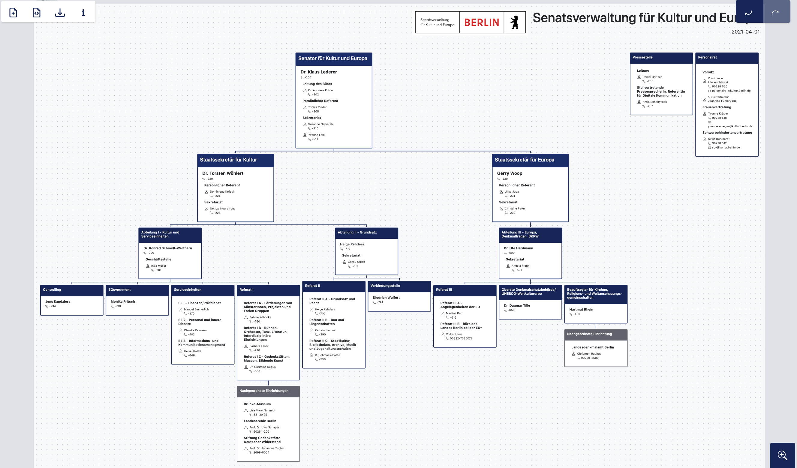

# In 10 Schritten zum maschinenlesbaren Organigramm

 

Das [Organigramm-Tool](https://organigramme.odis-berlin.de) hat zum Ziel, die Erstellung der Organigramme der Berliner Verwaltung zu vereinfachen und die Organigramme in ein einheitlicheres und maschinenlesbares Format zu bringen. Neben einer schicken grafischen Darstellung der Berliner Verwaltungsorganisation, welche sich unter anderem als PDF exportieren lässt, legt das Tool Organigramme als [JSON](https://berlinonline.github.io/open-data-handbuch/#formatwahl)-Dateien an. Dieses Dateiformat ermöglicht es, die eingegebenen Daten in einem einfachen Textformat zu speichern und auch wieder in das Tool einzuladen und zu bearbeiten. Durch das JSON-Format werden die Daten außerdem vielfältig als Open Data für ganz andere Anwendungen und Auswertungen nutzbar. Das Tool befindet sich derzeit in einer prototypischen Version.

 

#### Getting started: Wir führen Sie in 10 einfachen Schritten durch das Tool
 

**1) Tool öffnen und navigieren:** Das Tool funktioniert direkt im Browser, ein Download oder eine Anmeldung sind nicht nötig. Am besten funktioniert die Anwendung in Firefox und Chrome. Öffnen Sie folgende Internetseite in Ihrem Browser: [https://organigramme.odis-berlin.de](https://organigramme.odis-berlin.de). Wenn Sie das Tool zum ersten Mal aufrufen, dann sehen Sie ein von uns angelegtes Beispiel-Organigramm. Um sich an eine andere Stelle im Dokument zu bewegen, halten Sie die Maustaste gedrückt und ziehen Sie das Dokument. Unten rechts können Sie rein- und rauszoomen sowie die Ansicht auf das ganze Dokument aktivieren, alternativ können Sie dafür auch das Scrollrad der Maus benutzen. In der Leiste oben rechts gibt es Pfeile um Schritte *rückgängig* zu machen bzw. zu *wiederholen*.



**2) Informationen zu einer Organisationseinheit eintragen:** Jede der Boxen, die Sie sehen, stellt eine *Organisationseinheit* dar. Klicken Sie jetzt einmal auf eine der Boxen, die noch keine Beispielinformationen enthält. Es öffnet sich links das Bearbeitungsfenster. Geben Sie dort die Daten ein, die in der Kopfzeile der Box angezeigt werden sollen. Tragen Sie ein um welche Art von Organisationseinheit es sich handelt (diese Info erscheint nicht in der Box, sie ist aber für die JSON-Datei wichtig), also zum Beispiel um eine Abteilung oder um ein Referat. Mit Klick in das Textfeld macht Ihnen das Tool Vorschläge, Sie können aber auch Freitext eingeben. Tragen Sie als nächstes eine konkrete Bezeichnung ein, die als Titel der Box erscheinen soll, z.B. "Abteilung II - Kultur". Sie können zudem eine alternative Bezeichnung angeben, z.B. "Abt. II". Unter dem Punkt *Stil* können Sie die Darstellungsform der Box verändern.

*Hinweis: Die Darstellungsformen sind rein kosmetischer Natur. Wählen Sie "Hervorgehoben", um wichtige Einheiten wie einen Senator optisch hervorzuheben oder "Zurückgenommen" für Einheiten, die eine nachgeordnete Sonderrolle einnehmen, wie z. B. nachgeordnete Behörden. Der Stil "Verbindungspunkt" lässt die Box verschwinden und ersetzt sie durch einen reinen Knotenpunkt. Nutzen Sie diesen Stil nur wenn Sie ihn unbedingt brauchen, um bestimmte Hierachien abzubilden und tragen Sie dann keine Informationen in die Felder dieser Organisationseinheit ein.*



Nun kommen wir zum Inhalt der Box. In den nachfolgenden Feldern der Eingabemaske können Sie weitere Informationen eintragen. Das sind beispielsweise die Adresse und Kontaktdaten der Organisationseinheit. Wenn Sie Daten zu einer Person eintragen möchten, klicken Sie auf das kleine Plus-Symbol in der *Personen*-Leiste und tragen Sie Daten in die Maske ein. Sie können auch mehrere Personen hinzufügen. 

**3) Einheiten innerhalb einer Organisationseinheit anlegen:** Nicht nur Personen können Teil einer Organisationseinheit sein, sondern auch weitere zugehörige Abteilungen oder Stellen. Klicken Sie auf das Plus-Symbol neben *Zugehörige Organisationseinheit* um diese hinzuzufügen und tragen Sie eine Bezeichnung ein. Klicken Sie anschließend auf das Plus-Symbol neben *Personen*, um wiederum eine Person anzulegen, die Teil dieser zugehörigen Organisationseinheit ist und tragen Sie testweise Daten zu dieser Person in die neu erschienene Maske ein. Durch Klick auf das rote Minus-Symbol werden Organisationseinheiten und Personen wieder gelöscht.

*Hinweis: Personen und Organisationseinheiten können über das Minus-Symbol nur gelöscht werden, wenn vorher in den jeweiligen Textfeldern alle Texte entfernt wurden.*



**4) Neue Organisationseinheiten anlegen, entfernen und umsortieren:** Scrollen Sie im Bearbeitungsfenster der Organisation nach ganz unten. Klicken Sie dort auf die Buttons, um eine neue Nebenorganisation oder eine neue Suborganisation von Ihrer aktuell bearbeiteten Box einzufügen. Klicken Sie auf eine der neu erstellten Boxen und dann auf die Schaltfläche *Entfernen*, um die Box wieder zu löschen. Sie können die Organisationseinheiten auch kopieren, ausschneiden, einfügen oder entfernen, wenn Sie mit einem Rechtsklick auf die Box klicken. Sie können eine Box auch mit links anklicken, gedrückt halten und die Maus bewegen, um Boxen umzusortieren. Lassen Sie den Mauszeiger wieder los, wenn er sich über der grün eingefärbten Box befindet, an die die umzusortierende Box angehängt werden soll.

*Hinweis: Achtung, wenn Sie eine Organisationseinheit entfernen, löschen Sie auch alle Suborganisationen*



**5) Dokumentinformationen bearbeiten:** Neben dem eigentlichen Organigramm müssen Sie auch Informationen über das Dokument an sich angeben. Klicken Sie in der kleinen Menüleiste oben links auf das Symbol *Dokumentinformationen*. Es öffnet sich wieder eine Eingabemaske links. Tragen Sie über die Maske den Namen Ihrer Behörde als Dokumenttitel ein. Des Weiteren lässt sich die Ausrichtung des Dokuments (Hochformat oder Querformat) und die Ausgabegröße einstellen. In den Dokumentinformationen können Sie ebenfalls ein Logo einbinden. Bisher sind aus Lizenzgründen nur die Logos der Bezirksverwaltungen auswählbar. Sie können aber ganz einfach selbst eine Bilddatei mit einem Logo hochladen. Neben Datum und Name des Verfassers oder der Verfasserin kann hier auch die Fußzeile bearbeitet werden.

*Hinweis: Die Ausgabegröße können Sie auch später bei Bedarf anpassen, wenn Ihr Organigramm größer wird und die aktuelle Ausgabegröße nicht ausreicht.* 



**6) Fußzeile bearbeiten:** In der Fußzeile können Sie bei Bedarf weitere ergänzende oder beschreibende Informationen zum Organigramm eintragen. Die Formatierung funktioniert über [Markdown](https://www.heise.de/mac-and-i/downloads/65/1/1/6/7/1/0/3/Markdown-CheatSheet-Deutsch.pdf), Sie können jedoch auch einfach die Werkzeugleiste zum formatieren von Text verwenden. Die Unterpunkte der Fußzeile werden stets in Spalten dargestellt, eine Spalte entspricht einem Spiegelpunkt. Tragen Sie testweise beispielsweise die Adresse Ihrer Behörde in das Textfeld ein und klicken Sie auf *Übernehmen*.

*Hinweis: Wenn Sie beispielsweise ein * einbinden möchten, ohne dass dies als Markdown Syntax interpretiert und zu einer Kursiv-Formatierung führt, müssen Sie es wie folgt eintragen: \\* *



**7) Dokument (zwischen)speichern:** Alle Änderungen die Sie machen, werden automatisch für eine gewisse Zeit in Ihrem Browser gespeichert. Sie sollten Ihr erstelltes Organigramm aber auch abspeichern. Klicken Sie in der Menüleiste auf *Dokument speichern oder exportieren*. Wählen Sie *speichern* um die Daten als JSON-Datei herunterzuladen. Diese Datei ermöglicht es Ihnen die Datei zwischenzuspeichern, mit Kolleg:innen zu teilen und später daran weiterzuarbeiten. 



**8) Bestehendes Dokument einladen:** Ein Organigramm, das mit unserem Tool erstellt wurde, kann einfach wieder in der Anwendung geladen werden. Probieren Sie das einmal exemplarisch aus. Laden Sie sich <a href="data/senkult_organigramm.json" download="senkult_organigramm.json">hier</a> eine Beispiel-JSON-Datei herunter, in der das Organigramm für die Senatsverwaltung für Kultur und Europa gespeichert ist.
Gehen Sie nun zurück in das Organigramm-Tool und klicken Sie in der Menüleiste oben links auf das Symbol für *Neues Dokument erstellen oder öffnen*. Klicken Sie auf *Datei auswählen* und wählen Sie die gerade heruntergeladene Datei in ihrem Filesystem aus und laden diese hoch. Wählen Sie im erscheinenden Fenster *Verwerfen* aus. Sie sollten nun das Organigramm der SenKultEu sehen. Sie können sich das Organigramm auch hier als [PDF](data/senkult_organigramm.pdf) ansehen.

*Hinweis: Zum aktuellen Zeitpunkt ist es leider nicht möglich, ein bereits bestehendes Organigramm im PDF-Format zu importieren, sondern nur Organigramme im JSON-Format, die mit unserem Tool erstellt wurden.*



  

**9) Fertiges Organigramm exportieren:**

Sie können ein fertiges Organigramm auch als PDF oder Bilddatei exportieren. Klicken Sie in der Menüleiste auf *Dokument speichern oder exportieren*. 
Unter *Exportieren* werden Ihnen verschiedene Dateiformate zur Auswahl gestellt. Wählen Sie testweise *PDF* und *Bidmap* und klicken Sie auf den Button exportieren um ein PDF herunterzuladen.
<!-- tbd nochmal prüfen welche Formate es letztendlich zum Export gibt -->



**10) Mit einem neuen Dokument starten:**

Um wieder mit einem frischen Beispiel-Dokument zu starten, klicken Sie wieder links oben in der Menüleiste auf das Symbol für *Neues Dokument erstellen oder öffnen*. Klicken Sie diesmal anschließend auf *Neues Dokument erstellen* und dann auf *Verwerfen*. Sie sehen wieder das Organigramm vom Anfang.



 

Sie haben nun alle wichtigen Schritte und Funktionen testweise durchlaufen und können damit loslegen, ein Organigramm für Ihre eigene Behörde zu erstellen.

 

Sie haben Fragen oder Anregungen? Wir freuen uns über Ihre Meldung an <a href="mailto:odis@ts.berlin">odis@ts.berlin</a>.

<!-- **Die maschinenlesbare JSON-Datei sollten Sie als Open Data im Open Data Portal Berlin zur Verfügung stellen.** Eine automatische Anbindung ist zum aktuellen Zeitpunkt leider noch nicht integriert. Kommen Sie bei Fragen zur Veröffentlichung als Open Data gerne auf [uns](mailto:odis@ts.berlin) und [die Open Data Beauftragte oder den Open Data Beauftragten Ihrer Verwaltung](https://www.berlin.de/sen/wirtschaft/digitalisierung/open-data/open-data-beauftragte/) zu. -->

